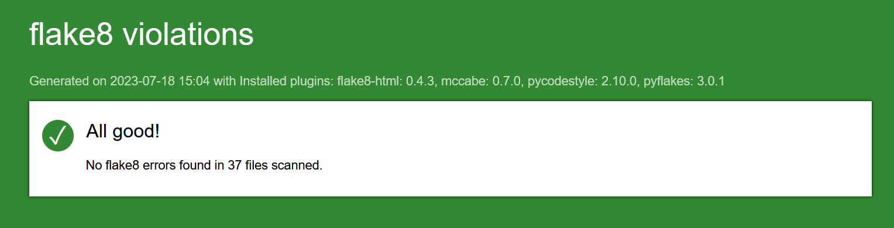

# <p align="center">OCP12</p>
  
CRM API for Epic Events.


## INSTALLATION


## Windows

```bash
git clone https://github.com/nopalpite/OCP12.git

cd OCP12 
python -m venv .env 
.env\Scripts\activate

pip install -r requirements.txt
```

## Linux  & MacOS

```bash
git clone https://github.com/nopalpite/OCP12.git

cd OCP12 
python -m venv .env 
source .env/bin/activate

pip install -r requirements.txt
```
        
## Database creation


Install [PostgreSQL](https://www.postgresql.org/download/) and refer to [documentation](https://www.postgresql.org) to launch server

Create database in SQL shell (psql): 
```bash 
CREATE DATABASE epic_events;
```
You can now populate database with the epic_events.sql file in the database folder following this [instructions](https://www.pgadmin.org/docs/pgadmin4/development/restore_dialog.html)

## Setup 

### Migrations

Place you in EpicEvents folder then:

```bash
python manage.py makemigrations
python manage.py migrate
```

### Superuser

Place you in EpicEvents folder then:

```bash
python manage.py create superuser
```

### Launch server and use it

```bash
python manage.py runserver
```
## Testing

Following accounts have been created so you can do some  testing

| Email | Password| Role|
| -------- | ------------- | -------|
| manager_1@gmail.com    | manager_password  | management  |
| sale_user_1@gmail.com    | sale_user_password  | sales  |
| sale_user_2@gmail.com    | sale_user_password  | sales  |
| support_user_1@gmail.com    | support_password  | support  |
| support_user_2@gmail.com    | support_password  | support  |

You can access to admin page with a manager account following this URL: http://localhost:8000/admin/

### coverage report

Place you in EpicEvents folder then:

```bash
python coverage run manage.py test
```


### flake8 report

Place you in OCP12 folder then:

```bash
flake8 --format=html --htmldir=flake-report EpicEvents
```


## Postman documentation

[postman documentation](https://documenter.getpostman.com/view/26061791/2s93zGzdF3)